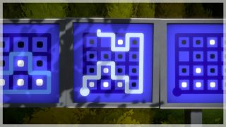
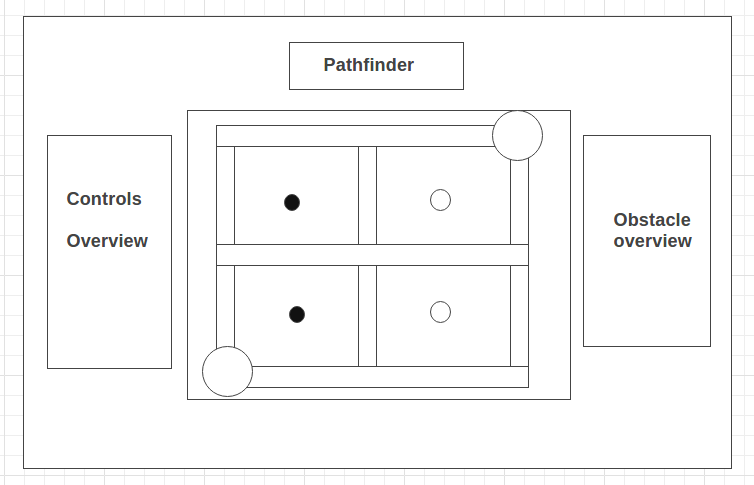

## Pathfinder

### Background

Pathfinder is a line drawing puzzle game in which players must make a path from a starting point to an end point while playing around objects located on the grid. Pathfinder is based on the puzzles found in The Witness by Thekla, Inc.

### Functionality & Minimum Viable Product

Users should be able to:

- [x] Reset the game board
- [x] Dynamically draw a line using the arrow keys to navigate through the grid

Additionally the project will include:
- [ ] A modal to describe the various puzzle obstacles available on the grid
- [ ] A production readme

### Wireframe

### Architecture and Technologies

This project will be implemented with the following technologies:

- Javascript and jQuery for underlying logic and skeleton
- Create.js library (easel.js) for visuals
- Webpack to bundle and run various scripts

Additionally, the following scripts will be used:
- `grid.js` to handle the grid logic and visual rendering
- `obstacle.js` to handle the puzzle obstacle logic to ensure that a puzzle solution is valid

### Implementation Timeline

**Day 1**: Create the skeleton of the project, including all necessary scripts. Begin learning easel.js from the Create.js library.

Goals:
- Initialize the project skeleton
- Learn basics of Easel.js rendering on a Canvas

**Day 2**: Finish up learning the Easel api, then start building out the grid and allowing for lines to be drawn within the grid.

Goals:
- Render a basic 5x5 grid
- Allow rendering of lines
- Show starting and ending locations

**Day 3**: Build out the obstacle pieces, and input their logic. Refactor the grid object so that logic of obstacle pieces accounts for grid win state.

Goals:
- Build obstacle object, logic
- Modify the grid such that the win condition accounts for all board obstacles present.

**Day 4**: Additional styling, obstacle implementation

Goals:
- Polished canvas
- Ensure grid is fully functional with various pieces,
- Generate various levels

### Bonus Features

- [ ] Additional puzzle obstacles
- [ ] A random grid generator
- [ ] A difficulty scale which will determine which puzzle obstacles can be present
